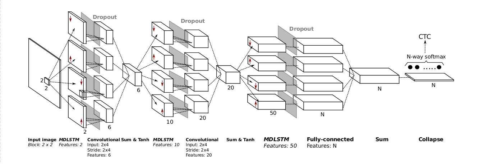

# Handwriting Recognition System
Converting scanned documents to text

Conventional Image to Text systems perform character level segmentation and then classify the segmented characters.
The aim of this project is to build an RNN based system to convert images to text, without segmentation.  

## Multi-Dimensional LSTM Architecture

